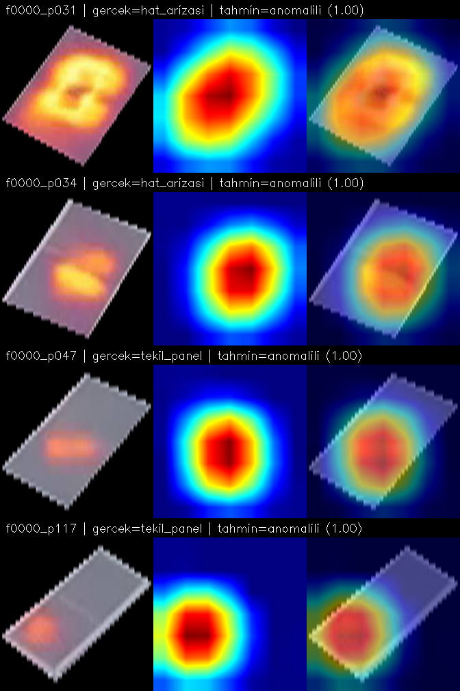
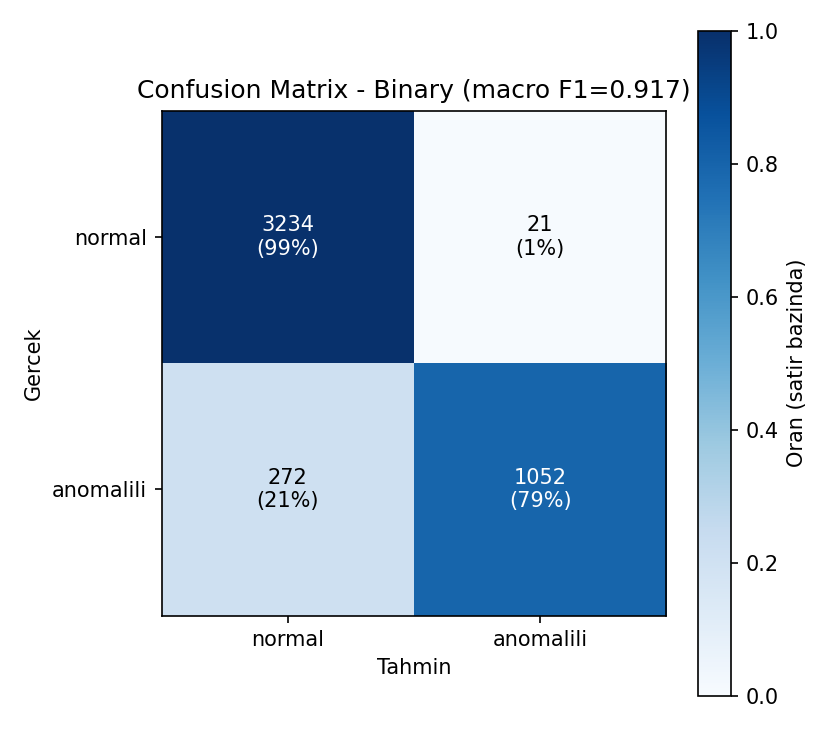

<div align="center">

# ☀️ Güneş Enerji Sistemlerinde Termal Anomali Tespiti

**Sentetik termal video verisinden uçtan uca bir arıza tespit sistemi**

[](https://www.python.org/)
[](https://pytorch.org/)
[](https://opencv.org/)
[](https://onnx.ai/)
[]()

*Staj Projesi — Sarp Lojistik (Eti Şirketler Grubu) · YBS, Bandırma Onyedi Eylül Üniversitesi*

<br>

**macro F1: 0.281 → 0.917** &nbsp;|&nbsp; **ONNX ile 2.6× hızlanma** &nbsp;|&nbsp; **Grad-CAM ile doğrulanmış**

</div>

---

## 📑 İçindekiler

- [Özet](#-özet)
- [Sonuçlar](#-sonuçlar)
- [Mimari](#️-mimari)
- [Pipeline](#-pipeline)
- [Görsel Kanıtlar](#️-görsel-kanıtlar)
- [Sınırlılıklar](#-sınırlılıklar-dürüstçe)
- [Repo Yapısı](#-repo-yapısı)
- [Kurulum](#-kurulum-ve-çalıştırma)
- [Dokümantasyon](#-dokümantasyon)

---

## 🎯 Özet

Gerçek bir termal kamera kurulumuna erişim olmadığı için, veri üretiminde
yapay zeka destekli video üretimi (**Google Gemini VEO**) kullanıldı. Proje;
panel tespiti, arıza analizi, iki aşamalı bir derin öğrenme mimarisi ve
model yorumlanabilirliği/üretime hazırlık adımlarını uçtan uca kapsıyor.

> **En dikkat çekici sonuç:** İlk (tek aşamalı, 4 sınıflı) model denemesi
> başarısız oldu (macro F1 = 0.281). Confusion matrix analiziyle kök sebep
> bulunup mimari iki aşamaya bölündü — sonuç 3 kata yakın iyileşti
> (macro F1 = **0.917**).

<br>

## 📊 Sonuçlar

### Model Gelişimi

| Deneme | Yaklaşım | Test Macro F1 |
|:---|:---|:---:|
| 1 | 4 sınıf, tek CNN | 0.281 ❌ |
| 2 | İkili CNN + geometrik tip ataması | **0.917** ✅ |

### Üretime Hazırlık (ONNX)

| Format | Boyut | Hız (ms/görüntü) | Macro F1 |
|:---|:---:|:---:|:---:|
| PyTorch (.pt) | 44.79 MB | 13.96 | 0.917 |
| 🟢 ONNX fp32 (optimize) | 44.70 MB | **5.47** ⚡ 2.6× | 0.917 |
| 🟡 ONNX int8 (kuantize) | **11.23 MB** 📦 4× | 89.67 (yavaşladı) | 0.914 |

<br>

## 🏗️ Mimari

<div align="center">

```
                    Panel Görüntüsü
                          │
                          ▼
          ╔═══════════════════════════════╗
          ║   AŞAMA 1 · CNN (ResNet18)     ║   🔵 öğrenilmiş
          ║   "Anomali var mı?"            ║      (transfer learning)
          ╚═══════════════════════════════╝
                          │
              ┌───────────┴───────────┐
           normal                 anomalili
                                       │
                                       ▼
                      ╔═══════════════════════════════╗
                      ║  AŞAMA 2 · Komşuluk Analizi    ║   🟢 kural-tabanlı
                      ║  "Tip ne?"                     ║      (geometrik)
                      ╚═══════════════════════════════╝
                                       │
                  ┌────────────────────┼────────────────────┐
                  ▼                    ▼                     ▼
           tekil_panel          hat_arizasi          string_arizasi
```

</div>

İlk denemede 4 sınıfı tek bir CNN'e öğretmeye çalışıldığında, model
`tekil_panel` ile `hat_arizasi`'yi sistematik olarak karıştırdı — çünkü
aralarındaki fark panelin **komşusunun** durumu, ve modele yalnızca tek
panelin görüntüsü veriliyordu. Bu bulgu üzerine mimari, öğrenilebilir olanı
(anomali var mı) öğrenilemeyecek olandan (uzamsal komşuluk yapısı) ayıracak
şekilde yeniden tasarlandı.

<br>

## 🔬 Pipeline

<table>
<tr><td width="40" align="center"><b>1</b></td><td><b>Video Üretimi</b></td><td>Gemini VEO ile sabit kamera açılı sentetik termal video</td></tr>
<tr><td align="center"><b>2</b></td><td><b>Kare Çıkarma</b></td><td>Videodan sabit aralıklarla görüntü çıkarma</td></tr>
<tr><td align="center"><b>3</b></td><td><b>Panel Tespiti</b></td><td>Manuel poligon etiketleme (5 otomatik yöntem başarısız oldu)</td></tr>
<tr><td align="center"><b>4</b></td><td><b>Panel Kırpma</b></td><td>Poligon maskesiyle panel bazlı görüntü + istatistik üretimi</td></tr>
<tr><td align="center"><b>5</b></td><td><b>Arıza Tespiti</b></td><td>HSV/hue tabanlı sıcak piksel analizi, zaman serisi p90 skoru</td></tr>
<tr><td align="center"><b>6</b></td><td><b>Etiketleme</b></td><td>Komşuluk grafiği + bağlantılı bileşenler ile tip sınıflandırma</td></tr>
<tr><td align="center"><b>7</b></td><td><b>Veri Seti Bölme</b></td><td>Panel-bazlı, sızıntısız train/val/test bölmesi</td></tr>
<tr><td align="center"><b>8</b></td><td><b>Model Eğitimi</b></td><td>ResNet18 transfer learning (2 deneme, mimari revizyonu)</td></tr>
<tr><td align="center"><b>9</b></td><td><b>Uçtan Uca Test</b></td><td>CNN + geometri entegrasyonu, sistem seviyesi doğrulama</td></tr>
<tr><td align="center"><b>10</b></td><td><b>Yorumlanabilirlik</b></td><td>Grad-CAM ile karar mekanizması görselleştirme</td></tr>
<tr><td align="center"><b>11</b></td><td><b>Üretime Hazırlık</b></td><td>ONNX dönüşümü, graf optimizasyonu, INT8 kuantizasyon</td></tr>
</table>

<br>

## 🖼️ Görsel Kanıtlar

| Grad-CAM (doğru tahmin) | Confusion Matrix (nihai model) |
|:---:|:---:|
|  |  |

> *Görsel yolları yerel klasör yapısına göredir; repo'yu klonlayıp pipeline'ı
> çalıştırdığında kendi çıktılarınla güncellenir.*

<br>

## ⚠️ Sınırlılıklar (Dürüstçe)

<details>
<summary><b>Detayları görmek için tıkla</b></summary>
<br>

- **Veri tamamen sentetik.** Model gerçek termal fizik değil, "termal
  görüntü nasıl görünür" örüntüsünü öğrendi. Gerçek dünyaya doğrudan
  genellenemez.
- **Veri seti küçük** (286 fiziksel panel-video örneği). Hafif overfitting
  gözlemlendi, erken durdurma ile telafi edildi.
- **Geometrik tip ataması kusursuz değil** (uçtan uca test: %82.5 tam
  eşleşme). Üç farklı yöntem denendi, hiçbiri tüm sınır durumlarını
  çözemedi.
- **Bir düzeltme denemesi geri alındı.** Kenar panellerindeki bir Grad-CAM
  bulgusunu düzeltmeye çalışırken sistem geneline zarar verildiği görülüp
  değişiklik geri alındı — süreç raporda şeffaf biçimde belgelendi.

</details>

<br>

## 📁 Repo Yapısı

<details>
<summary><b>Klasör ağacını görmek için tıkla</b></summary>

```
├── 00_videos/            Kaynak videolar (repoda yok, .gitignore'da)
├── 01_scripts/           Ana pipeline script'leri (1-11)
├── 02_debug_tools/       Geliştirme sırasında kullanılan teşhis araçları
├── 03_data/              Kareler, panel şablonu, kırpımlar (repoda yok)
├── 04_analysis/          Hotspot analizi, etiketler, veri seti bölmesi
├── 05_models/            Eğitilmiş model ağırlıkları + confusion matrix
├── 06_results/           Uçtan uca sonuçlar, Grad-CAM görselleri
├── 07_debug_outputs/     Ara doğrulama görselleri
├── 08_reports/           Staj raporu, kod açıklamaları, proje özeti (PDF)
└── requirements.txt
```

</details>

<br>

## 🚀 Kurulum ve Çalıştırma

```bash
pip install -r requirements.txt
```

Script'ler sırayla (`01_scripts/` içinde) çalıştırılır; her biri bir
öncekinin çıktısını girdi olarak kullanır. Detaylı açıklamalar
`08_reports/` klasöründeki dokümanlarda.

## 🛠️ Kullanılan Araçlar

<div align="center">

`OpenCV` · `NumPy` · `PyTorch` · `torchvision` · `ONNX` · `ONNX Runtime` · `Matplotlib` · `Google Gemini VEO`

</div>

## 📄 Dokümantasyon

| Doküman | İçerik |
|---|---|
| 📘 Staj Sonu Teknik Raporu | Problem, yöntem, bulgular, tartışma |
| 📗 Kod Açıklamaları | Script bazlı, blok blok açıklama |
| 📙 Satır Satır Açıklamalar | Kod satırı bazlı referans |
| 📕 Proje Pusulası | Sözlü sunum rehberi + hızlı teknik referans |

---


